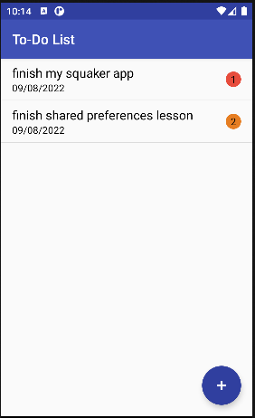
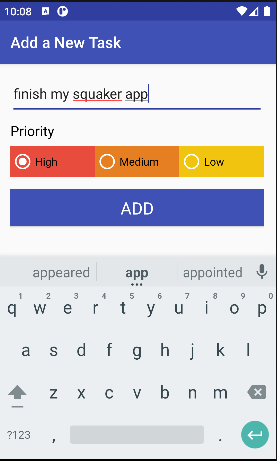
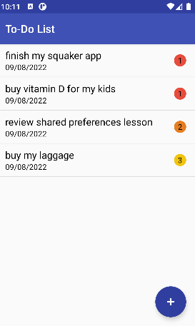
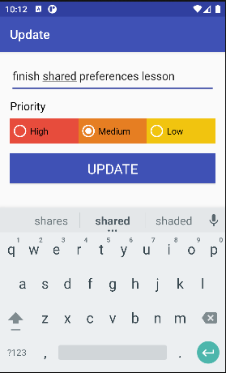

# ToDo-List
An android Application that display a list of to do tasks which user can initiate, modify or delete any task .
using Android Architecture Component 
* Room database
* liveData 
* ViewModel

## Screenshots

